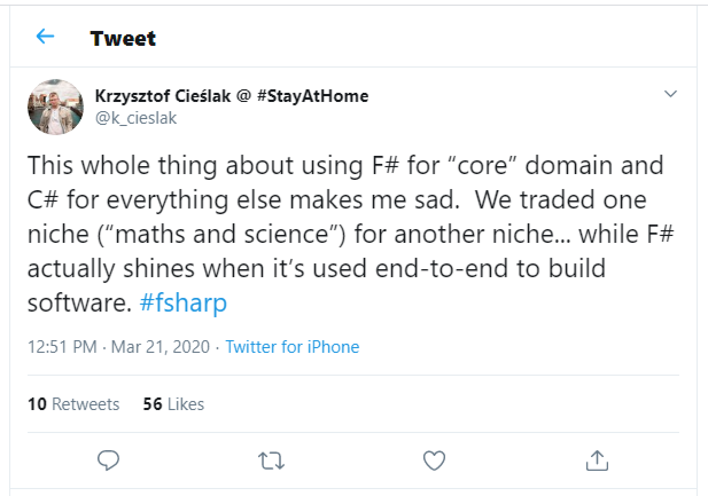
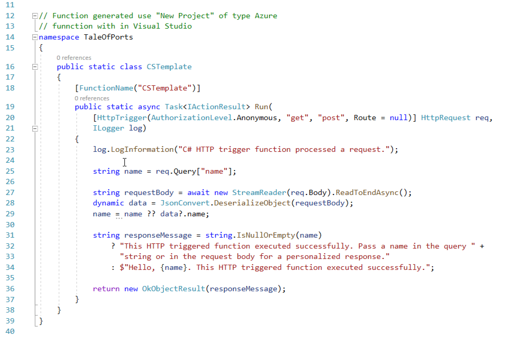
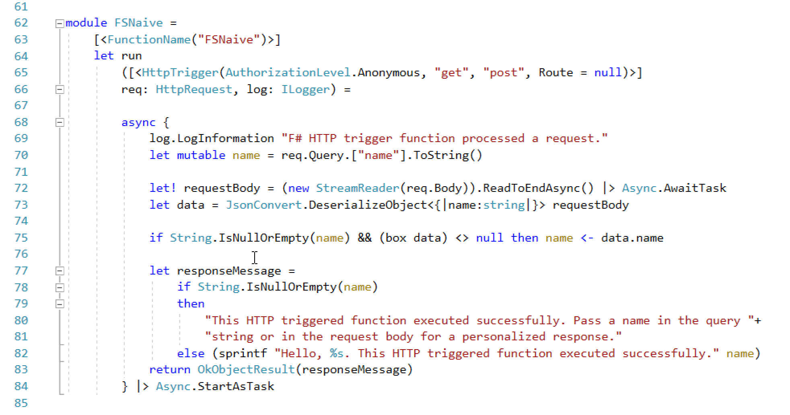
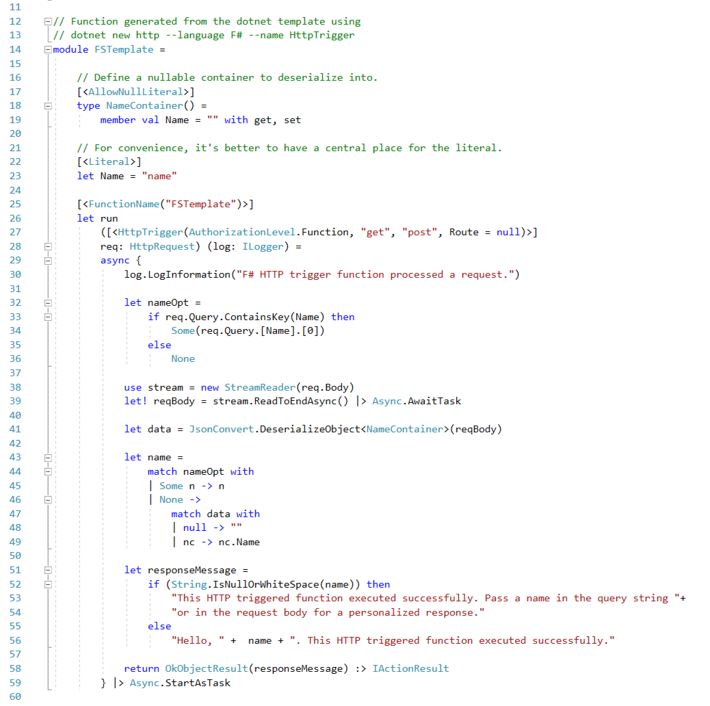

# A Tale of Ports

Like all good technical tales it started with tweet.  



That got me thinking, what about taking a "out of the box" Visual Studio Code C# HTTP Triggered functions project and porting it to F#. The idea is to do a few ports, one a naïve line by line translation of the C# into F#. This is almost always very straight forward and the resulting F# tends to look like the C# with less ceremony. Other ports will explore if more idiomatic versions are an improvement. 

## The C# Version

To create the C# version I used the templates in a recent version Visual Studio 2019 with .net Core 3.x installed to create a new HTTP Triggered Azure Functions Project. See https://github.com/jbeeko/tale-of-ports for the repository. Except for a few changes to naming and formatting this is what I got:




Fairly straight forward, mostly boiler plate and `using` statements up to line 19. Then some logging,  an attempt to get a query parameter called `name`, then an attempt to get a value called `name` from any JSON body that may be present. Finally if either of those extract a name create a result with a personalized greeting. Otherwise one with a generic greeting. 


## The F# Version

I then used the dotnet tooling to add a F# Azure Functions project to the solution. This is very straight forward, you install the dotnet CLI templates, create the project directory then initialize a new project with an appropriate template ([more here](https://www.aaron-powell.com/posts/). 
```
$> dotnet new --install Microsoft.Azure.WebJobs.ProjectTemplates
$> dotnet new func --language F# --name FunctionsInFSharp
```

Copying the C3 code and taking a few minutes to edit the C# function resulted in this: 



The first thing to notice is how similar it is to the C# version. It really is possible to take a snippet of C# and write it as F# without much effort. This is true not just here but across StackOverflow as well.  

The next thing to notice is that like in the C# case much of the complexity is in checking for empty or null input. Something that feels foreign to F# developers. I (tried)[https://github.com/jbeeko/tale-of-ports] to re-write this in a more idiomatic way but did not come up with anything was as brutally obvious. 

To enable idiomatic type safe F# functions will probably require a small (probably < 150 line) module wrapping `HttpRequest`, `HttpRespsonse`. Something for another day.  

But even as it stands there does not seem to be any reason to create a solution with the domain modeling in F# and the interface to the HTTP machinery in C#. If you use F# for the domain it will be simplest to use a F# solution though-out. F# will definitely shine in the domain model and can interface to any .NET infrastructure just as easily as C#.


## About that FS CLI Function Template

I was curious how the function created from the template looked so I installed it with:

```
$> dotnet new http --language F# --name HttpTrigger
```

That resulted in this the below. Frankly I don't think this makes much of a case for F#. Not only is it 50% longer than the C# version giving the impression that F# results in more complex code. It is also neither a literal port of the C# version showing a C# highlighting the correspondence between the two, nor is it elegant F# demonstrating how an F# programmer should write the same function.  




