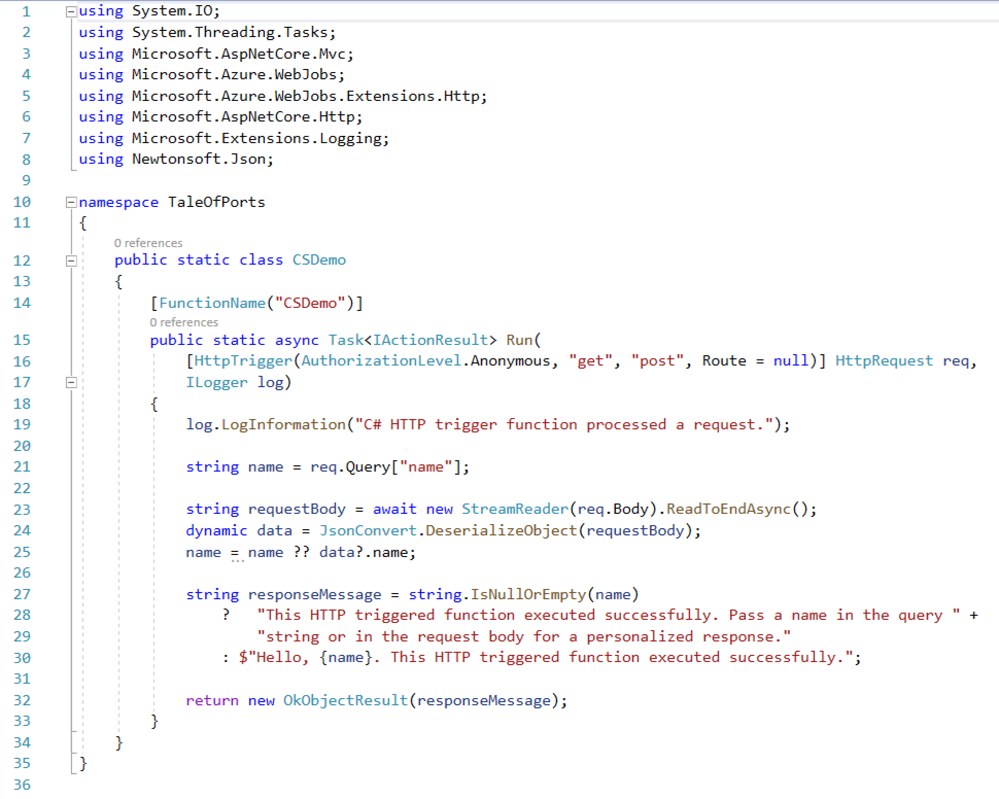
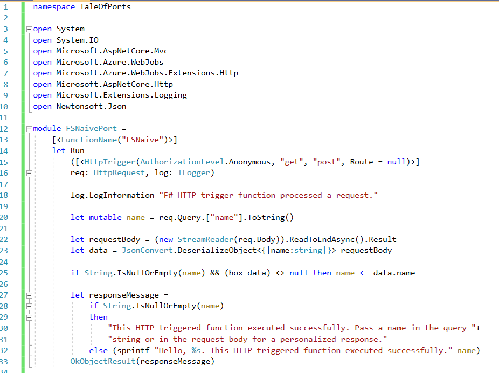

# A Tale of Ports

Like all good technical tales it started with tweet.  

That got me thinking, what about taking a "out of the box" Visual Studio Code C# HTTP Triggered functions project and porting it to F#. The idea is to do a few ports, one a naïve line by line translation of the C# into F#. This is almost always very straight forward and the resulting F# tends to look like the C# with less ceremony. Other ports will explore if more idiomatic versions are an improvement. 

## The C# Version

To create the C# version I used the templates in a recent version Visual Studio 2019 with .net Core 3.x installed to create a new HTTP Triggered Azure Functions Project. See xxxx for the repository. Except for a few changes to naming and formating this is what I got:

Fairly straight forward, mostly boiler plate and `using` statements up to line 19. Then some logging,  an attempt to get a query parameter called `name`, then an attempt to get a value called `name` from any JSON body that may be present. Finally if either of those extract a name create a result with a personalized greeting. Otherwise one with a generic greeting. 

One thing that stands out is the amount of null and empty string checking. 

## The F# Versions

I then used the dotnet tooling to add a F# Azure Functions project to the solution. This is very straight forward and Aaron Powell, @slace, has a guide [here](https://www.aaron-powell.com/posts/2020-01-13-creating-azure-functions-in-fsharp/).

Copying the C# function and taking a few minutes to edit the C# function resulted in this: 

The first thing to notice is how similar it is to the C# version. It really is possible to take a snippet of C# and write it as F# without much effort. This is true not just here but across StackOverflow as well. This is because most of the complexity is in the the .Net framework and not C#. 

The next thing to notice is that like in the C# case much of the complexity is in checking for empty or null input. Something that feels foreign to F# developers. But even as it stands there does not seem to be any reason to create a solution with the domain modeling in F# and the interface to the HTTP machinery in C#. If you want to use F# for the domain it will be simplest to use a F# solution though-out. 

